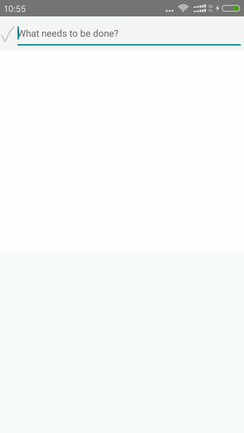

# React-Native 实现的TodoList
这是一个基本的TodoList，加入了AsyncStorage实现存储。


### 如何执行
####  1、将项目克隆到本地，cd到React-redux-2
```javascript
git clone git@github.com:kiss19861127/TodoApp.git
cd todoApp
```
#### 2、安装依赖
```javascript
yarn
```
或
```javascript
yarn install
```
#### 3、执行
```javascript
react-native run-android
```
